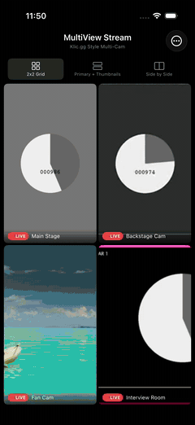
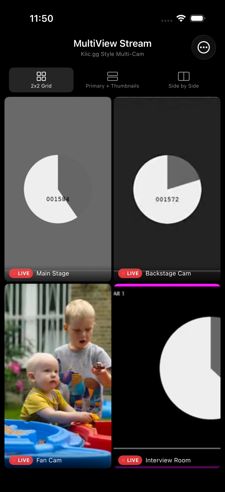
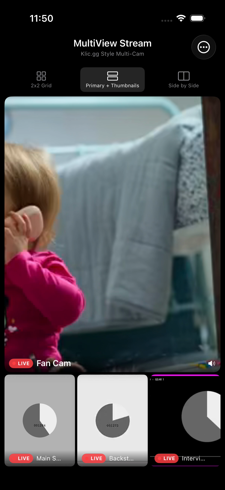
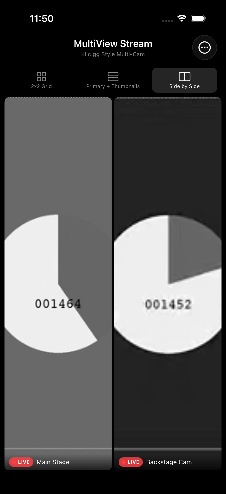
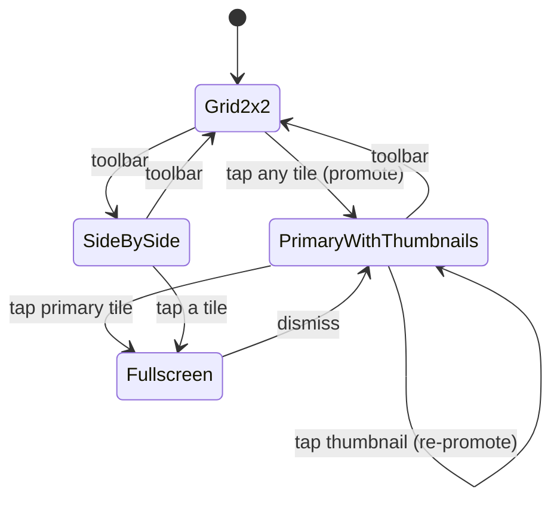

# MultiView Stream (iOS)

A SwiftUI multi-view live stream viewer for iOS - watch up to four **HLS** streams at once, switch layouts on the fly, promote any feed to primary, and go fullscreen. Built with **AVFoundation** / **AVPlayer**, the **Observable** macro, and **KVO**-driven playback state. Inspired by Klic.gg-style multi-cam viewing.

## Demo



Live cycling through the three layouts: 2x2 grid, primary + thumbnails, and side by side.

## Screenshots

| 2x2 Grid | Primary + Thumbnails | Side by Side |
|----------|----------------------|--------------|
|  |  |  |

## Features

- Four concurrent HLS streams via AVPlayer
- Three layouts - 2x2 grid, primary + thumbnails, side by side
- Tap a tile to promote it to primary; tap primary to go fullscreen
- Adaptive bitrate per role - primary gets up to 2 Mbps, thumbnails capped at 500 kbps
- Audio follows the primary feed (only the focused stream is unmuted)
- KVO-driven status per stream - idle, loading, buffering, playing, paused, error
- Live FPS + memory overlay (`PerformanceMonitor` via `CADisplayLink`)
- Memory guard pauses the lowest-priority stream past a 400 MB threshold
- `matchedGeometryEffect` spring transitions between layouts
- Swift 6 concurrency, `@MainActor`-isolated player manager

## Architecture

MVVM with a single `@MainActor @Observable` player manager owning all AVPlayer instances; SwiftUI views observe it and `AppState` directly.

```mermaid
flowchart TD
    User([User]) -->|tap tile / pick layout| HomeView

    subgraph UI[SwiftUI Views]
        HomeView -->|layout + primaryIndex| Grid[MultiStreamGridView]
        Grid -->|frames in size| Layout[[StreamLayout.frames]]
        Grid --> Tile[StreamTileView]
        Tile --> VPV[VideoPlayerView<br/>UIViewRepresentable]
        HomeView --> Overlay[PerformanceOverlayView]
        HomeView -->|fullScreenCover| Full[FullscreenPlayerView]
    end

    HomeView <-->|currentLayout, primaryIndex| State[(AppState<br/>@Observable)]

    subgraph Core[Player Core - @MainActor]
        Mgr[StreamPlayerManager<br/>@Observable]
        Mgr -->|players UUID:AVPlayer| AVP[AVPlayer x4]
        Mgr -->|KVO status/buffer/rate| Status[(statuses UUID:StreamStatus)]
        Mgr -->|promoteToPrimary| Bitrate[StreamConfiguration<br/>primary 2Mbps / thumb 500kbps]
        Mgr -->|enforceMemoryLimit 400MB| Pause[pause lowest-priority]
    end

    HomeView -->|loadStreams / startAll| Mgr
    Tile -->|player for id| Mgr
    VPV -->|AVPlayerLayer| AVP

    Provider[HLSStreamProvider] -->|availableStreams| Mgr
    Perf[PerformanceMonitor<br/>CADisplayLink] -->|fps + memoryMB| Overlay
```

### Layout transitions



## Project Structure

```
MultiViewStream/
├── App/
│   ├── MultiViewStreamApp.swift   # @main entry
│   └── AppState.swift             # @Observable UI state (layout, primary, overlay)
├── Models/
│   ├── StreamSource.swift         # stream identity (id, title, url)
│   ├── StreamStatus.swift         # idle/loading/buffering/playing/paused/error
│   └── StreamLayout.swift         # layouts + tile frame math
├── Services/
│   ├── StreamProviding.swift      # provider protocol
│   ├── HLSStreamProvider.swift    # sample HLS sources
│   ├── StreamConfiguration.swift  # per-role bitrate / resolution
│   ├── StreamPlayerManager.swift  # owns AVPlayers, KVO, memory guard
│   └── PerformanceMonitor.swift   # CADisplayLink FPS + memory
├── Views/
│   ├── Home/HomeView.swift        # toolbar + grid + overlay + fullscreen cover
│   ├── Grid/MultiStreamGridView.swift
│   ├── Components/ (StreamTileView, VideoPlayerView, PerformanceOverlayView)
│   └── Fullscreen/FullscreenPlayerView.swift
└── Extensions/AVPlayer+Status.swift
```

## Requirements

- Xcode 15+, iOS 17.0+
- Swift 6
- XcodeGen (`brew install xcodegen`)

## Build & Run

```bash
xcodegen generate
open MultiViewStream.xcodeproj
```

Select the `MultiViewStream` scheme and run on an iOS 17+ simulator or device. Streams come from Apple's public HLS test sources, so no API key or backend is required.

## Tech Stack

- SwiftUI + `@Observable`
- AVFoundation / AVPlayer + `AVPlayerLayer`
- KVO for playback state, `CADisplayLink` for FPS
- `matchedGeometryEffect` + `GeometryReader` for layout transitions
- XcodeGen, XCTest

## License

MIT
